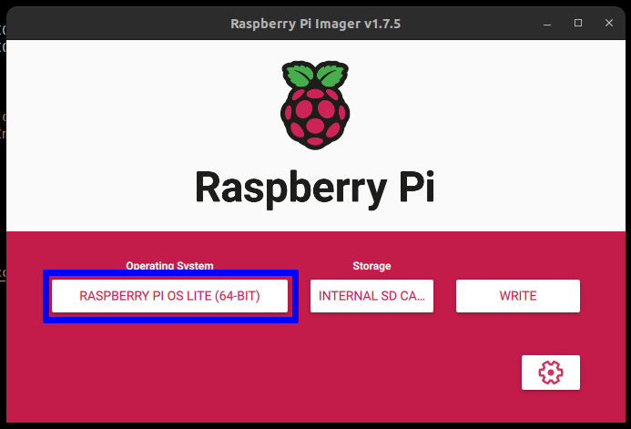
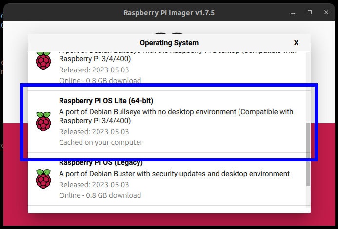
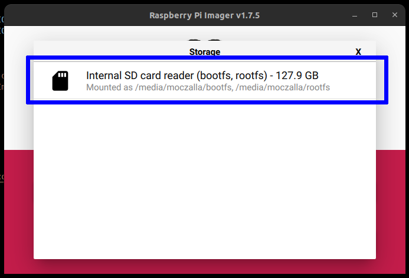
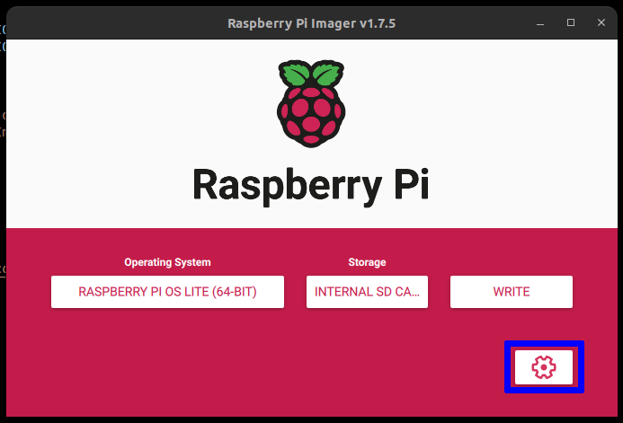
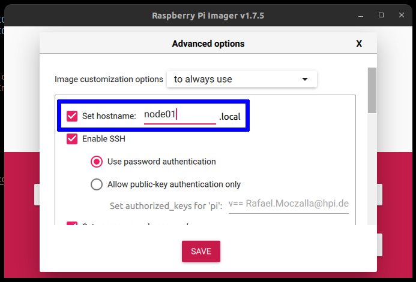
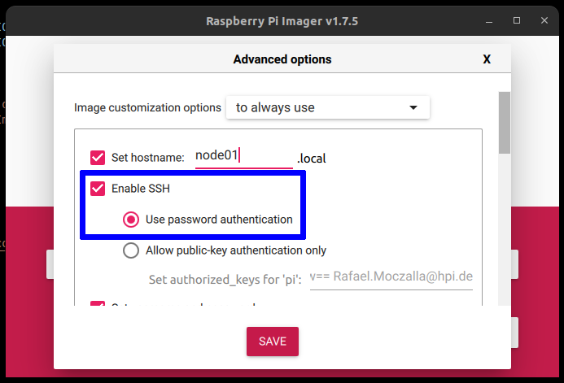
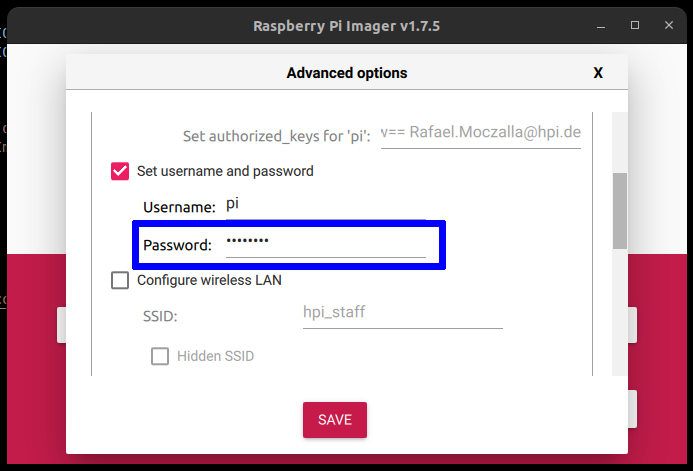
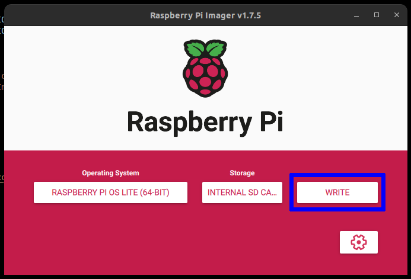

## Build a HPC-Cluster with Raspberry Pis

Now we install an operating system for the Pi cluster nodes.

### Prepare Micro SD Cards

We already inserted the SD-Cards into the Pi cluster. You need to remove them one by one and follow the instructions. After that, we set up our SD-Cards and install the OS for our Raspberry Pis. Download the Raspberry Pi Imager [here](https://www.raspberrypi.com/software/) and plug in your SD-Card. Select **Raspberry Pi OS Lite (64 Bit)** as the operating system of the Pi nodes.

Insert the SD card into your laptop and select the SD card in the imager.

Additionally, go to settings and set the hostname in the advanced options (`node01`, `node02`, ..., `node05`), enable ssh and set `raspberry` as the password.

And finally write the image to the SD card.

After preparing all SD-cards the tutorial splits and explains for mac, Windows and Ubuntu users how to connect to the Pi cluster via network with ssh. Make sure to open the appropriate `tutorial_01_[..].md`. The `tutorial_01_clustersetup_and_ssh_with_[mac|ubuntu|windows]_workstation.md` name gives you a hint on which operating system is targeted.
