## Monitoring Setup

Now we add the Dashboard that is in the dashboard folder.

### Set up Prometheus as source

First open a web browser and open the URL `http://node01:3000`. You should see the Grafana GUI. Afterwards we add Prometheus as our data source. On the Grafana page click on `Home` and select `Connections`.

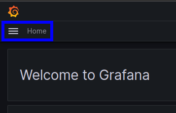

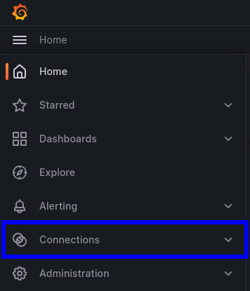

Next search for Prometheus and select it.

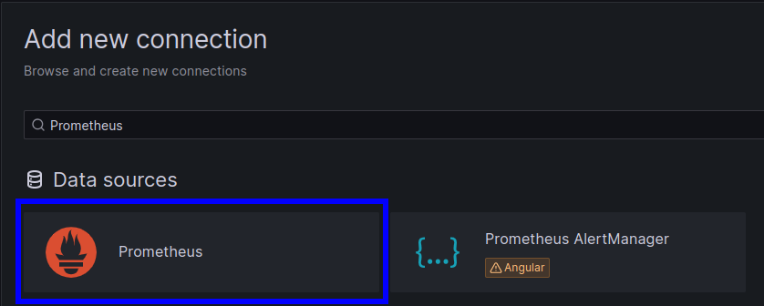

Here click on `Add new data source` and enter as the `Connection` URL the Prometheus URL of node01 which is `http://node01:9090`.

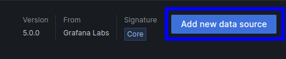

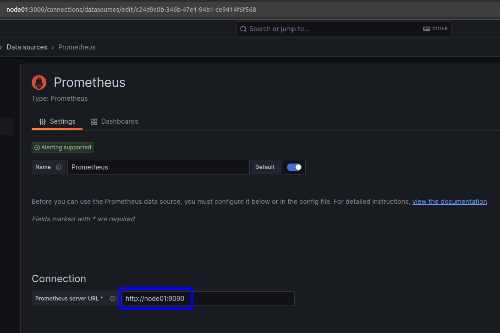

Next save the UID which is the last end of the URL alter the last slash `/` and click on `Save & test`.

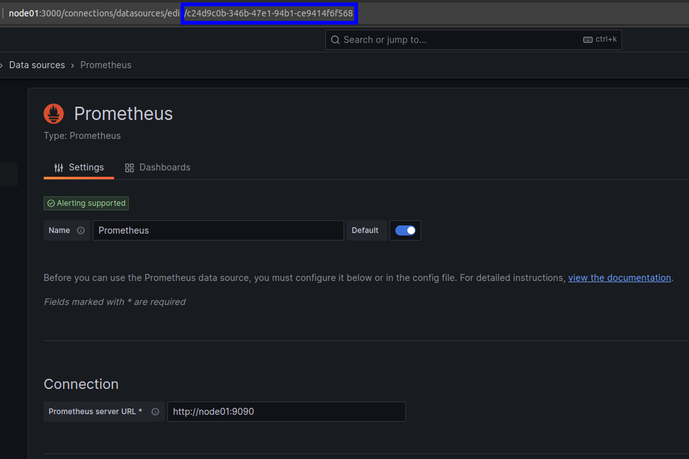

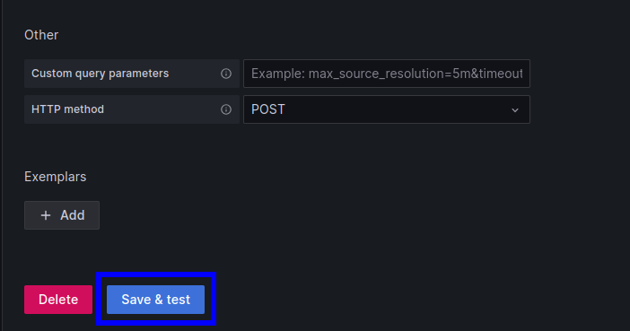


### Dashboard import

Now click on the `building a dashboard`.


Afterwards click on the `Import dashboard`.

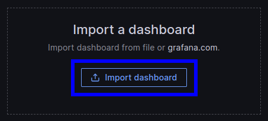

In the next window drag and drop the `Pi Cluster.json` file into the box and click on Import

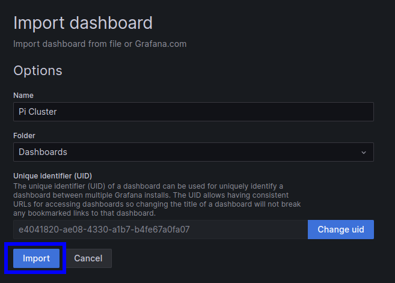

Next we need to update the UID of our Prometheus datasource. Click on the settings button, i.e. the little gear symbol, and

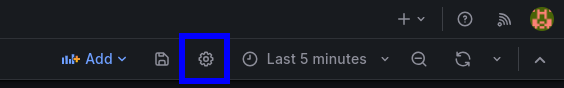

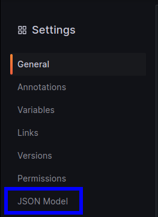

Here search with `ctrl + f` for all occurences of `"uid": "null"` and replace it with your datasource UID that you copied earlier.

Click on `Save changes` and `Close`. Afterwards you should see a similar dashboard to the following one.

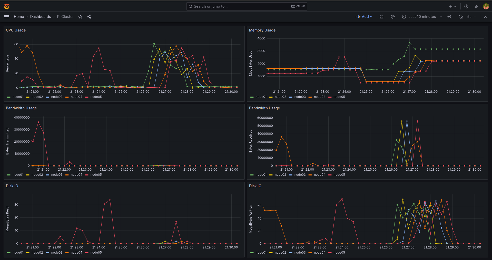

### IO test with Fio

Now you can download the benchmarking tool `Fio` and test if the dashboard will change when we run a simple read write example.

```bash
ssh pi@node05
sudo apt --yes install fio
fio --rw=readwrite --name=test --size=1000M --direct=1 --bs=1M
```
