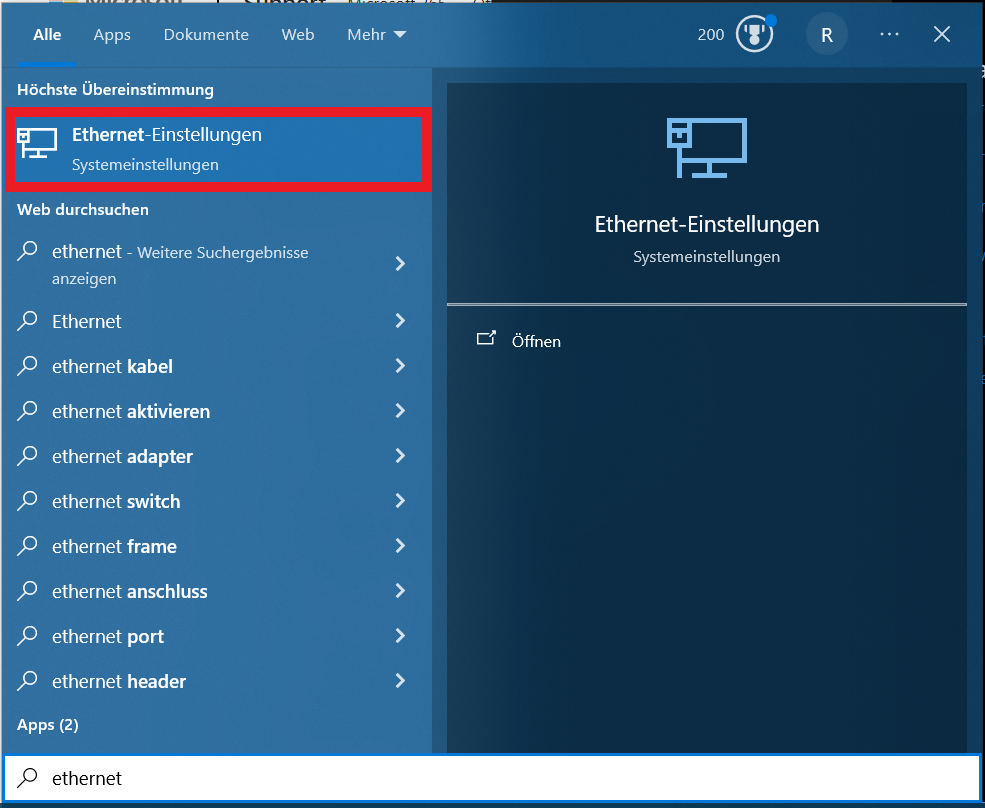
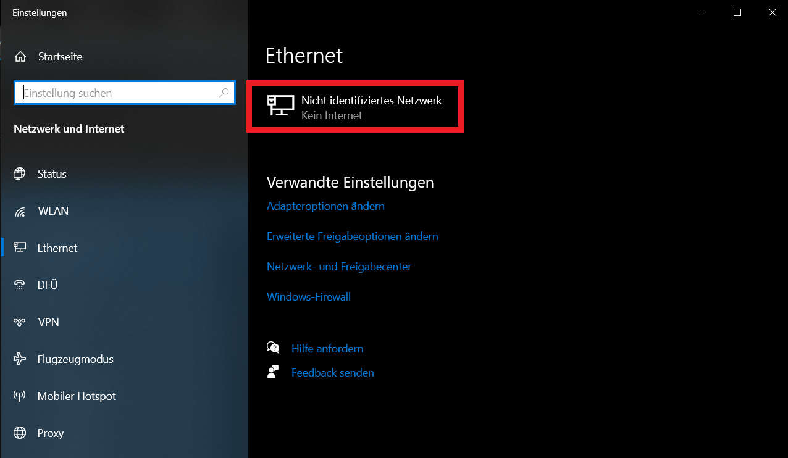
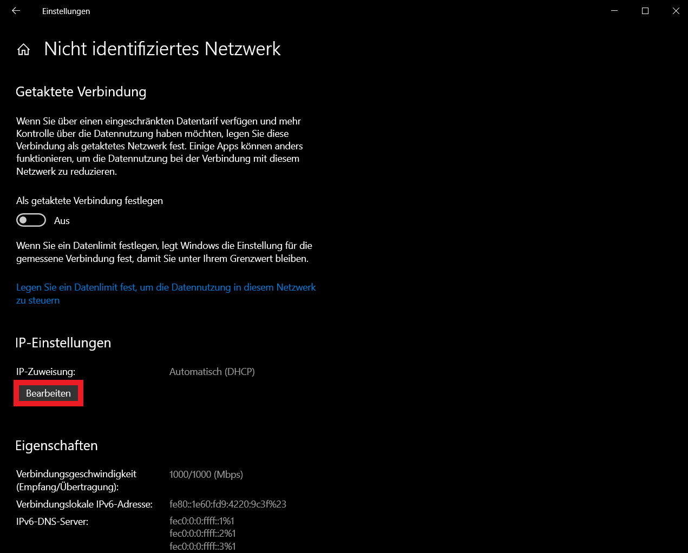
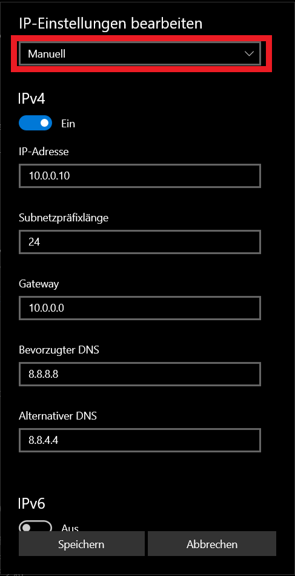

## Build a HPC-Cluster with Raspberry Pis

Now we will set up the Windows workstation to be able to ssh into the cluster nodes.

### Setup Workstation Network

After inserting the Ethernet USB Device into your laptop open the Ethernet settings.



Next click on the new not identified Ethernet Network.



Click on the IP editing button to modify the IP of the network device.



Select `Manuell` and enable only IPv4. Set the IP address `10.0.0.10`, the subnet `255.255.255.0` represented as subnet length `24`, the gateway `10.0.0.0` and `8.8.8.8` as well as `8.8.4.4` as the DNS and alternative DNS servers. Apply the changes by clicking on the Save button.



Next we enable IP forwarding. Open a Windows PowerShell as administrator and enable IP forwarding with `Set-NetIPInterface -Forwarding Enabled`. After that check if IP forwarding is activated with `Get-NetIPInterface | select ifIndex,InterfaceAlias,AddressFamily,ConnectionState,Forwarding | Sort-Object -Property IfIndex | Format-Table`.

```bash
Set-NetIPInterface -Forwarding Enabled
Get-NetIPInterface | select ifIndex,InterfaceAlias,AddressFamily,ConnectionState,Forwarding | Sort-Object -Property IfIndex | Format-Table
```

The output should look similar to this:
```
ifIndex InterfaceAlias               AddressFamily ConnectionState Forwarding
------- --------------               ------------- --------------- ----------
      1 Loopback Pseudo-Interface 1           IPv6       Connected    Enabled
      1 Loopback Pseudo-Interface 1           IPv4       Connected    Enabled
      1 WLAN                                  IPv4       Connected    Enabled
      3 Ethernet                              IPv6       Connected    Enabled
      3 Ethernet                              IPv4       Connected    Enabled
```

Next we set the hostnames for our cluster nodes. Open an editor as an administrator and add at the bottom of file `C:\Windows\System32\drivers\etc\hosts` the following lines.
Important: Only use spaces (no tabs etc.) as column delimiters!

hosts:

```
[...]

# Pi Cluster
10.0.0.1    node01
10.0.0.2    node02
10.0.0.3    node03
10.0.0.4    node04
10.0.0.5	node05
```

Now you are able to connect to the pi nodes with e.g. `ssh pi@node01` when they are running.
