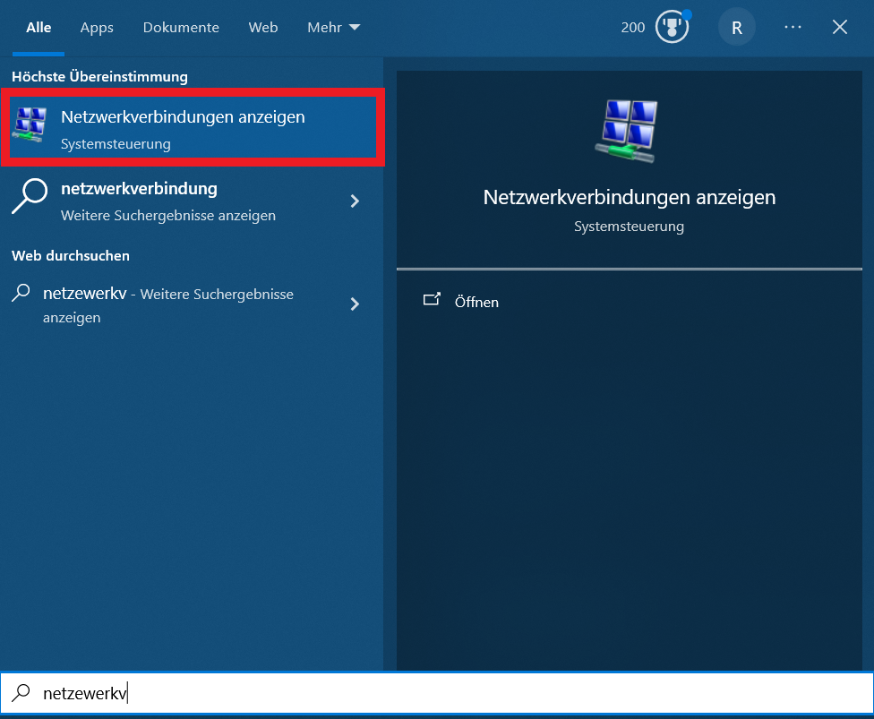
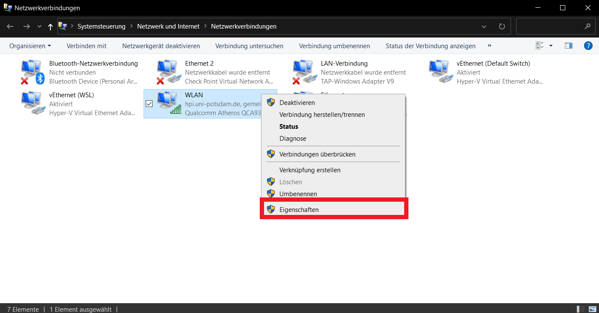
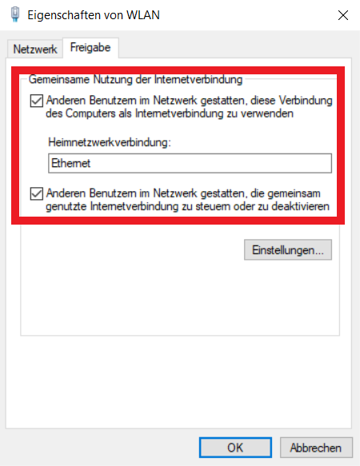

## Build a HPC-Cluster with Raspberry Pis

Now we will set up the Windows workstation to be able to share internet with the cluster.

### Share the Internet Connection

Next we share the internet connection with the Pi cluster. In Windows go to the settings of network connections.

Right click on the network interface that provides the internet and select properties.

Under sharing check the checkbox and select the name of the network device connected to the pi cluster. Click on OK when you selected everything.

Windows might have reset your network configuration of the Ethernet connection from last step after this, in which case you simply need to change it again.

Done! Now your Pi cluster should have a working internet connection.
