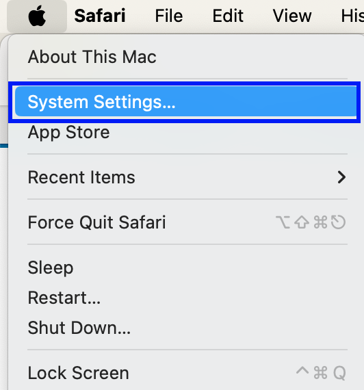
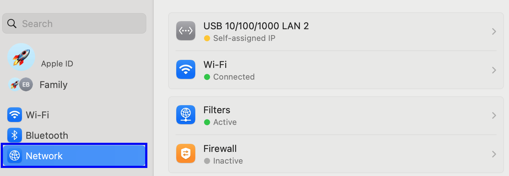
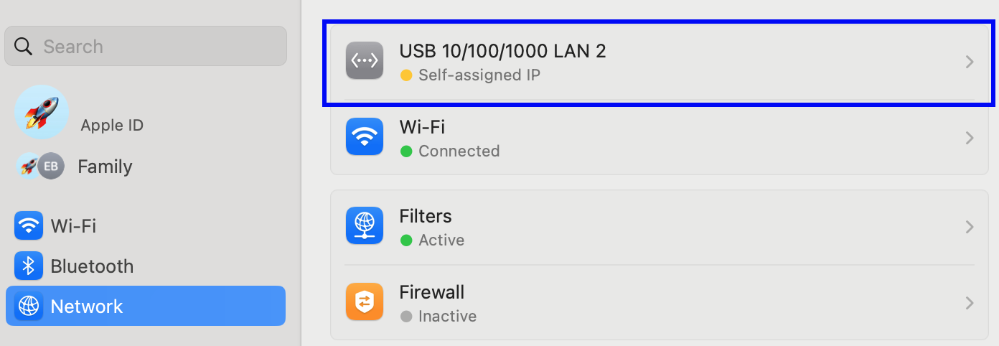
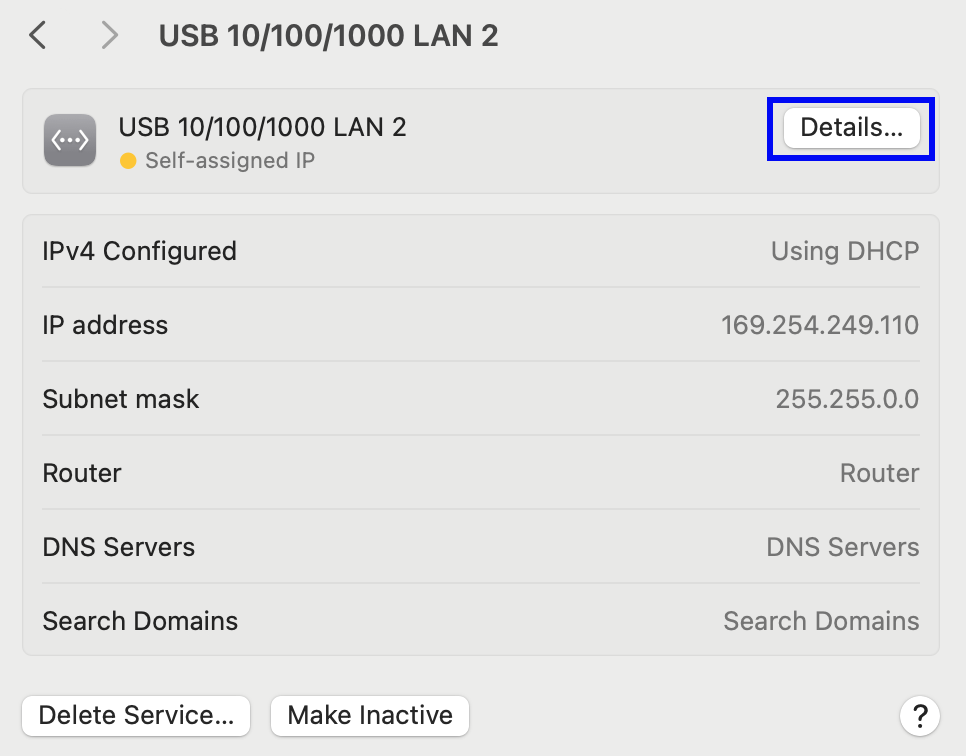
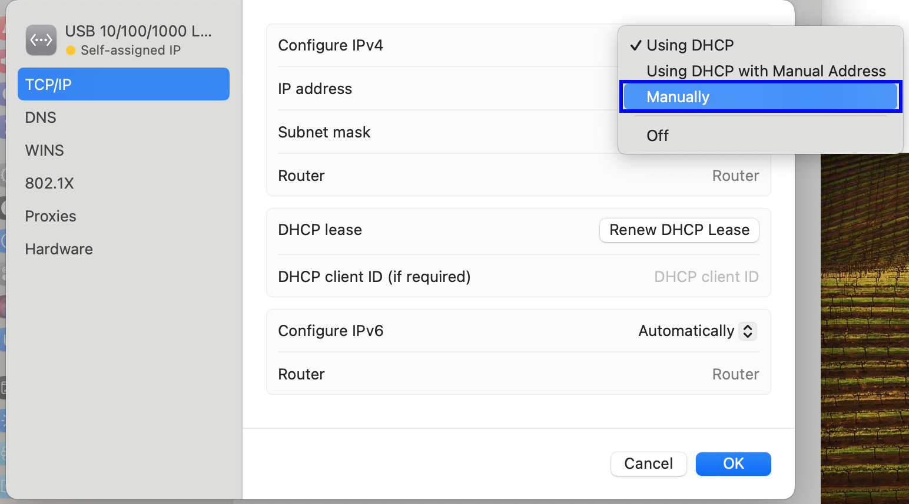
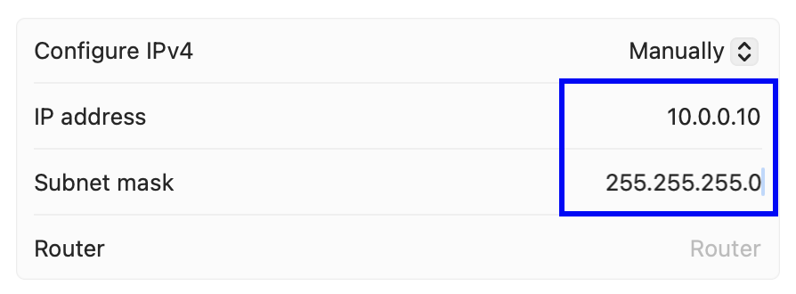

## Build a HPC-Cluster with Raspberry Pis

Now we will set up the mac workstation to be able to ssh into the cluster nodes.

### Setup Workstation Network

After inserting the Ethernet USB Device into your laptop open the Network settings. First go to system settings.



Then go to network settings. To do that click on the `Network` button.



Select the device connected to the Pi cluster and set the IPv4 configuration to `Manuell`.



To change the IP address to a static one click on `Details`.



First we have to change the IPv4 configuration to static IP by selecting the option `Manually`.



Next set the IP address to `10.0.0.10` and the subnet to `255.255.255.0` and click on `OK`.



When the static IP setup went well you should see the following window and when you connect the USB Ethernet adapter with LAN cable to the powered on switch the network should be connected.


Next we set the hostnames for our cluster nodes. Open the `/etc/hosts` file and add the following lines at the end.

hosts:

```
[...]

# Pi Cluster
10.0.0.1	node01
10.0.0.2	node02
10.0.0.3	node03
10.0.0.4	node04
10.0.0.5	node05
```

Now you are able to connect to the pi nodes with e.g. `ssh pi@node01` when they are running.
